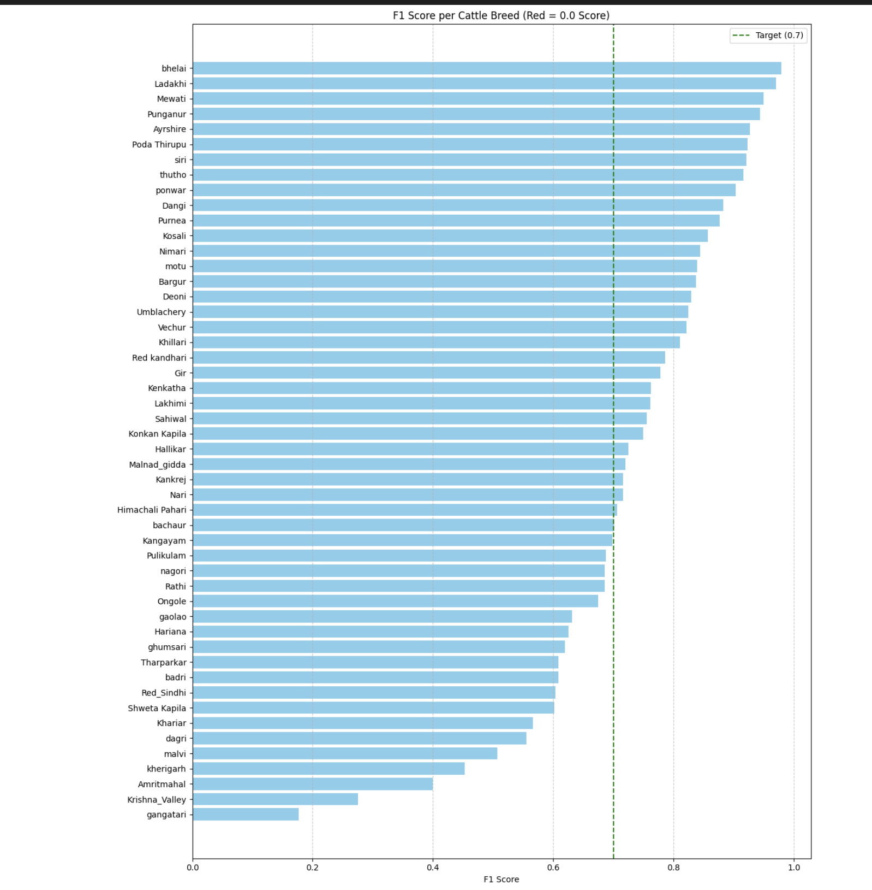

# 🐄 Indian Cattle Breed Classification (50 Classes)

This project implements a complete, end-to-end Deep Learning pipeline using **TensorFlow** to classify 50 different breeds of Indian cattle. It includes a high-performance training pipeline using a modern **ConvNeXt-Tiny** architecture and a clean, local web dashboard built with **Streamlit** for real-time model inference.

## 🚀 Technical Overview & Architecture
* **Core Framework:** TensorFlow 2.x / Keras
* **Base Backbone:** ConvNeXt-Tiny (Transfer Learning via ImageNet weights) optimized for robust feature extraction.
* **Custom Classification Head:** * `GlobalAveragePooling2D` for spatial dimensionality reduction.
  * `BatchNormalization` to stabilize the learning process and accelerate convergence.
  * `Dropout` layers to heavily penalize over-reliance on specific features and prevent overfitting on dominant classes.
  * `Dense` output layer utilizing Softmax activation for the 50 distinct classes.
* **Optimization Strategy:** Integrated a custom loss function utilizing **Label Smoothing** to prevent the model from becoming hyper-confident, significantly boosting performance and stability on historically low F1-score (visually similar) breeds.
* **Data Integrity:** Dataset processed using MD5-based deduplication to prevent data leakage between train and test sets.

## 💻 Web Interface & Cloud Architecture
* **Interactive UI:** A real-time inference frontend built with **Streamlit** featuring visual multi-class probability breakdown metrics.
* **Cloud Storage:** Model weights (~350 MB) are hosted externally on **Hugging Face** and dynamically downloaded/cached by the web app to bypass local repository size constraints and scale efficiently.

## 📂 Repository Structure
```text
├── cattle_breed.ipynb        # Training, evaluation, and optimization notebook
├── app.py                    # Streamlit web application code
├── requirements.txt          # Dependencies required to execute the pipeline
├── .gitignore                # Prevents tracking system caches and heavy weights
└── F1_score.png              # Model evaluation matrix visualization
```
## 📊 Results & Model Evaluation

The model's performance was evaluated using a comprehensive 50-class breakdown, prioritizing the **F1-Score** as the primary metric to ensure a balanced assessment of precision and recall across all native breeds.

### Key Performance Insights
* **Granular Feature Extraction:** ConvNeXt-Tiny successfully mastered highly granular visual variations—such as hump structures, horn shapes, and dewlap folds—allowing it to accurately distinguish between visually similar breeds (e.g., Sahiwal, Gir, and Tharparkar).
* **Robustness on Low F1-Score Breeds:** Standard training pipelines often overfit on dominant classes and collapse on rare or highly similar breeds. By incorporating **Label Smoothing** into the loss function, the model was prevented from becoming overconfident, significantly boosting the classification accuracy and stability of historically low F1-score breeds.
* **Top-K Real-World Accuracy:** In production inference testing via the Streamlit interface, the top-3 confidence distributions consistently isolate the correct breed as the primary prediction, with closely related regional variations naturally filling the secondary and tertiary probabilities.



### Core Optimization Framework
| Component | Implementation Details | Engineering Objective |
| :--- | :--- | :--- |
| **Base Backbone** | ConvNeXt-Tiny (Transfer Learning) | High-efficiency, multi-class feature extraction from ImageNet weights |
| **Spatial Reduction** | `GlobalAveragePooling2D` | Flattens 2D feature maps into a 1D vector to prevent parameter explosion |
| **Training Stabilization** | `BatchNormalization` | Standardizes layer inputs to accelerate convergence and stabilize learning |
| **Regularization** | `Dropout` & Label Smoothing | Penalizes hyper-confidence and feature-reliance to prevent overfitting on dominant classes |
| **Classification Output** | `Dense` Layer (50 Units) | Maps the extracted features to the final 50 native breed predictions |
| **Inference Processing** | Softmax Top-3 Sort Mapping | Provides clear, formatted probabilistic distributions for the Streamlit UI |
| **Data Synchronization** | Alphabetical Directory Sorting | Ensures strict alignment between Keras internal training indices and web UI arrays |
