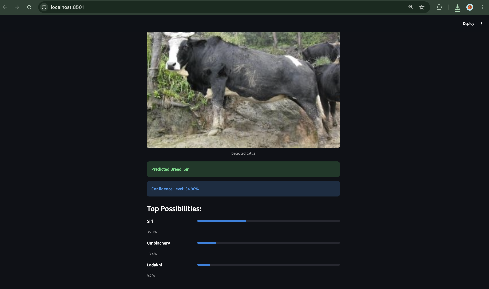
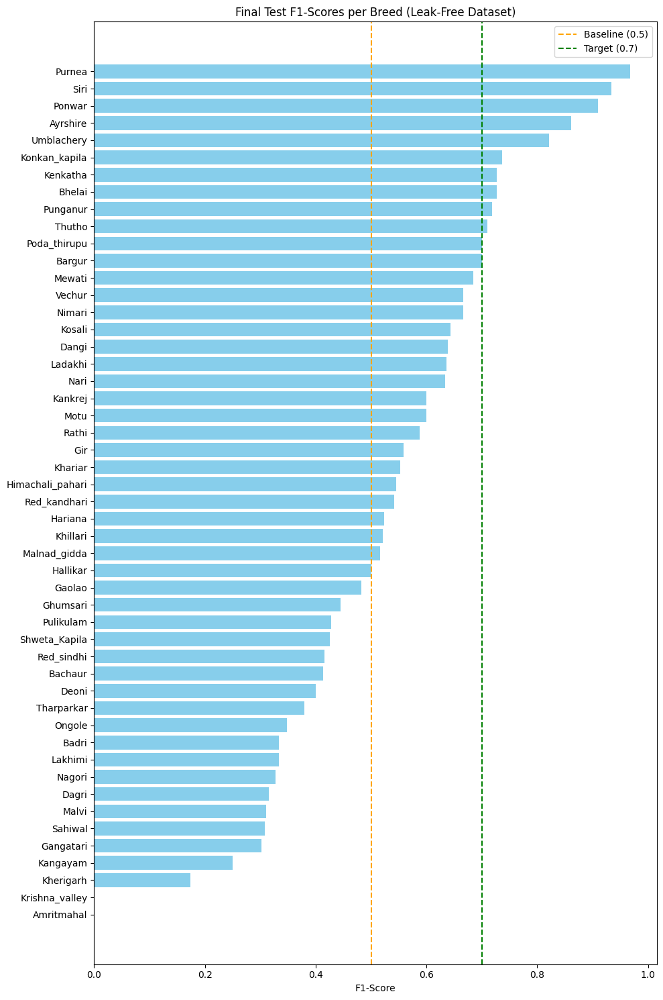
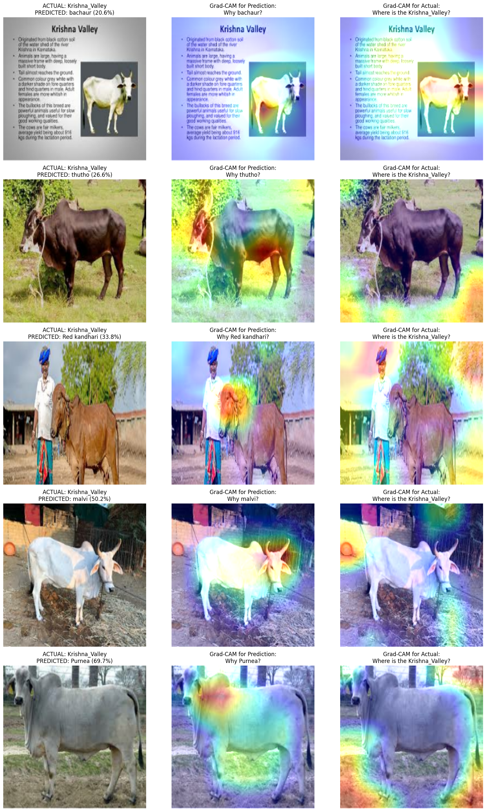
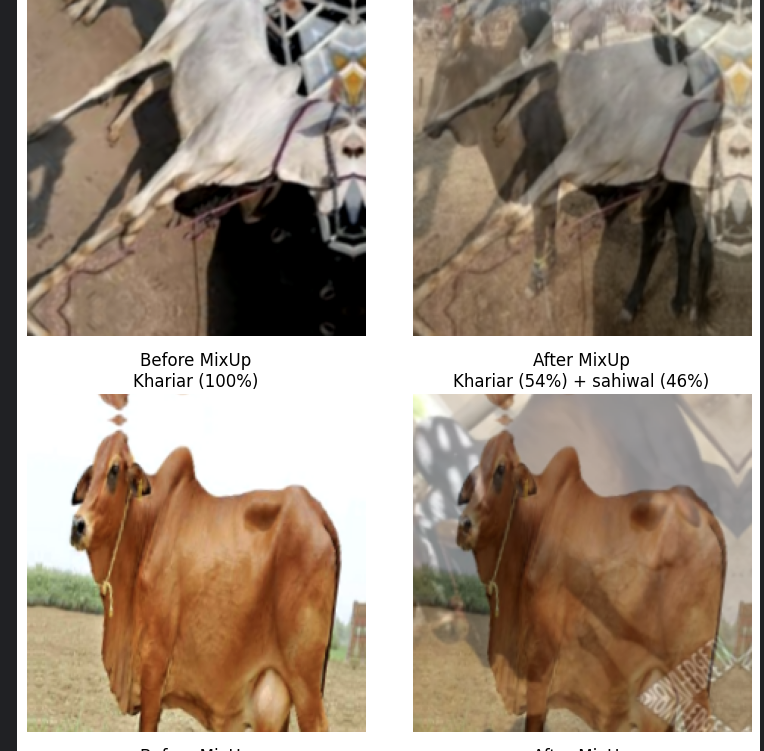

# 🐄 Indian Cattle Breed Classifier

A fine-grained image classifier that identifies **50 Indian cattle breeds** from a photograph — built end-to-end, from scratch-collected data to a deployed web app.

This started as a tutorial-free first computer vision project and turned into a full applied-ML exercise: building a custom dataset from scattered online sources and YouTube footage, discovering and fixing a real data-leakage problem, debugging a subtle TensorFlow/Keras bug in the fine-tuning loop, and shipping a working Streamlit app on top of it.

## Table of Contents
- [App Demo](#app-demo)
- [Results](#results)
- [Dataset](#dataset)
- [Model Architecture](#model-architecture)
- [Training Methodology](#training-methodology)
- [Web App](#web-app)
- [Repository Structure](#repository-structure)
- [Setup & Installation](#setup--installation)
- [Tech Stack](#tech-stack)
- [Known Limitations](#known-limitations)

## App Demo



## Results

**Held-out test accuracy: 52.72%** across 50 fine-grained breed classes, measured on a video-level held-out test set that was never touched during training or model selection.

> **Why this number is lower than an earlier version of this project claimed (~75%), and why that's the right outcome:**
> The initial dataset was built by merging two Kaggle datasets, utilizing MD5 hashing to successfully eliminate exact duplicates. However, investigating the model's decision-making using Grad-CAM revealed a major issue: the dataset still contained significant noise, including human faces, text, and complex background graphics. The Grad-CAM heatmaps showed the model was "cheating" (shortcut learning) by latching onto these irrelevant background artifacts instead of focusing on the actual subject.

> For this updated version, the dataset was strictly manually cleaned to remove these misleading images. Forcing the model to genuinely learn the correct features rather than relying on spurious background correlations naturally drops the accuracy score to 52.72%. While lower, this metric is honest, robust, and much more reflective of how the model will actually perform in the real world..

### Per-breed F1 scores



### Grad-CAM: verifying the model looks at the right thing

Fine-grained breed classification can fail silently — a model can hit good numbers while actually keying off background, lighting, or watermarks instead of the animal itself. Grad-CAM was used throughout development to check this.



*High-confidence, correctly-classified examples were checked specifically to rule out the model "getting lucky" via shortcuts — the activation consistently lands on the animal rather than background clutter, though some diffuse (rather than tightly feature-localized) activation remains, discussed in [Known Limitations](#known-limitations).*

### MixUp augmentation



*MixUp blends pairs of training images and their labels proportionally, discouraging the model from memorizing sharp decision boundaries around individual training examples — a meaningful regularizer given several breed classes have fewer than 150 images.*

## Dataset

50 Indian cattle breeds, built from scratch by combining and cleaning several sources:

- **Merged public datasets** found on Kaggle and elsewhewhere, combined and deduplicated.
- **YouTube video frame extraction** — targeted collection for underrepresented breeds, with frames sampled at intervals and near-duplicate frames removed via perceptual hashing (not just exact-match hashing).
- **YOLO-based cropping** — every image is passed through a YOLO detector to crop tightly around the animal, reducing background/shortcut-learning risk and keeping training and inference preprocessing consistent.
- **Manual cleanup** — hand-reviewed collection for the rarest, most underrepresented breeds where automated sourcing wasn't enough.

**Leak-proof splitting:** val/test frames are drawn from an entirely separate pool of source videos that never contributes to the training set — leakage is prevented by construction, not just detected after the fact.

Class balance is imbalanced but bounded (~7.6x between the largest and smallest classes after rebalancing, down from ~17x in an earlier version), addressed during training with class-weighted loss.

## Model Architecture

- **Backbone:** ConvNeXtSmall, ImageNet-pretrained, with Keras' built-in input preprocessing enabled for consistency with the pretraining recipe.
- **Head:** Global Average Pooling → LayerNormalization (ε=1e-6) → Dense(256, GELU, L2-regularized) → Dropout(0.6) → Dense(50, softmax).
- **Precision:** mixed float16 for training throughput.
- Input resolution: 224×224.

## Training Methodology

**Progressive 4-phase fine-tuning**, unfreezing more of the backbone at each stage while stepping the learning rate down:
1. Frozen backbone — train the head only.
2. Last 30 backbone layers unfrozen.
3. Last 60 backbone layers unfrozen.
4. Full backbone unfrozen.

**AdamW**, not plain Adam — ConvNeXt's training recipe assumes *decoupled* weight decay, which behaves predictably across all weights regardless of their gradient history; L2-regularization mixed into a plain-Adam gradient gets unevenly scaled by Adam's own per-parameter adaptivity, which isn't what you want from weight decay.

**Class-weighted, MixUp-compatible loss** — standard `class_weight` arguments in Keras assume a single hard label per example, which breaks once MixUp blends two images' labels together. A custom loss computes each sample's weight as the *dot product* of the (possibly blended) label vector with the class-weight vector, so a 70/30 MixUp blend gets a correctly proportional weight rather than an undefined one.

**Held-out test set discipline** — the test set is evaluated exactly once, after every training phase and hyperparameter decision is finalized. Model checkpointing and early stopping use the validation set only.


## Web App

A Streamlit app (`app.py`) for interactive inference:

1. User uploads a photo.
2. A YOLO model detects and crops the cattle from the image — the same crop-to-animal step used during dataset creation, keeping inference consistent with training.
3. The cropped image is classified by the ConvNeXt model, hosted on Hugging Face Hub and downloaded on first run (too large for the git repo directly).
4. Top-3 predicted breeds are shown with confidence bars.

### Running it locally

```bash
git clone https://github.com/Satvik524/cattle-breed-classification.git
cd cattle-breed-classification
pip install -r requirements.txt
streamlit run app.py
```

The classifier weights download automatically from Hugging Face Hub on first launch. YOLO weights download automatically via `ultralytics` on first use.

## Repository Structure

```
├── app.py                                          # Streamlit inference app
├── notebooks/
│   ├── 01 collecting_and_cleaning_data.ipynb                    # Creating the Dataset for the new model
│   ├── 02 cattle_breed_final.ipynb                     # Evaluating the previous model and training the new one
│   └── 03 cattle_breed_old.ipynb                     # Training of the previous model
├── images                                         # README images (F1 chart, Grad-CAM, MixUp)
├── requirements.txt
└── README.md
```

*(Notebook filenames above are suggested — rename your uploaded files to match for a cleaner repo layout.)*

## Setup & Installation

```bash
git clone https://github.com/Satvik524/cattle-breed-classification.git
cd cattle-breed-classification
pip install -r requirements.txt
```

Core dependencies: `tensorflow`, `streamlit`, `ultralytics`, `pillow`, `numpy`, `scikit-learn`, `imagehash`.

## Tech Stack

- **Modeling:** TensorFlow / Keras, ConvNeXtSmall
- **Detection/cropping:** YOLO (Ultralytics)
- **Data engineering:** perceptual hashing (`imagehash`), OpenCV/PIL
- **App:** Streamlit
- **Hosting:** Hugging Face Hub (model weights)

## Known Limitations

- **`Krishna_valley` currently scores 0 F1.** This breed has a naturally wide color range (grey-white, white, brown-and-white, black-and-white, mottled, per breed references), which was initially suspected as a possible mislabeling issue in the training images — that suspicion didn't hold up on inspection; the images appear to be genuine, correctly-labeled examples of natural breed variation. The more likely explanation is plain data scarcity: this is a rare breed with limited available footage, and available sources have been exhausted. Documented here rather than papered over.
- A handful of other low-count classes (under ~100 training images) score below the rest of the distribution for similar reasons — fine-grained classification with this much per-class variation is a genuinely hard regime below a certain sample size.
- The model has not been benchmarked against real-world, non-curated photos beyond the held-out test set and informal Streamlit testing.
